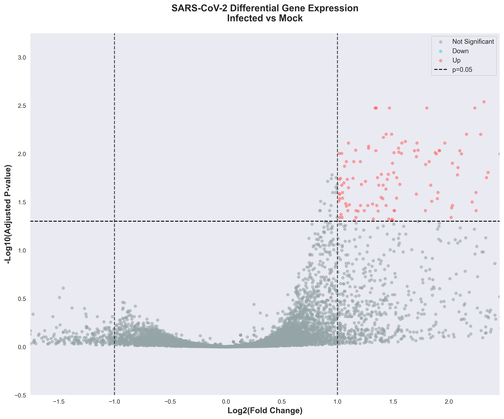

# SARS-CoV-2-Differential-Expression-Analysis
RNA-seq analysis identifying differentially expressed genes in SARS-CoV-2 infected human cells compared to mock controls.

## 🎯 Project Overview

Statistical analysis of RNA sequencing data to identify genes significantly upregulated or downregulated during SARS-CoV-2 infection.

**Dataset**: GSE147507 from NCBI Gene Expression Omnibus

## 📊 Key Results



**Findings:**
- **125 significantly upregulated genes** (|Log2FC| > 1, adj. p < 0.05)
- Strong immune activation and interferon response signature
- Rigorous statistical validation with FDR correction

## 🔬 Analysis Performed

- Quality control and data filtering
- Log2 transformation and normalization
- Statistical testing (t-tests with multiple testing correction)
- Differential expression classification
- Volcano plot visualization

## 🛠️ Tools & Methods

**Language**: Python 3.x

**Libraries**: 
- GEOparse - Data acquisition from NCBI
- pandas & numpy - Data manipulation
- scipy - Statistical testing
- statsmodels - FDR correction (Benjamini-Hochberg)
- matplotlib & seaborn - Visualization

**Statistical Methods**:
- Independent t-tests (infected vs mock)
- Benjamini-Hochberg FDR correction
- Log2 fold change analysis

## 📁 Project Structure
```
├── data/              # Expression data
├── figures/           # Volcano plot and QC visualizations
├── results/           # DE analysis results (CSV)
└── analysis.ipynb     # Main analysis notebook
```

## 🚀 Key Skills Demonstrated

✓ RNA-seq data analysis  
✓ Statistical hypothesis testing  
✓ Multiple testing correction  
✓ Data visualization  
✓ Biological interpretation

## 📈 Sample Information

- **Infected samples**: 21 SARS-CoV-2 infected cells
- **Mock samples**: 27 control samples
- **Genes analyzed**: 15,427 (after QC filtering)

---

**Part of my #Bioinformatics learning journey** 🧬

*Previous project: [SARS-CoV-2 Genome Analysis]*

Up next!
Multiple virus comparisons.
